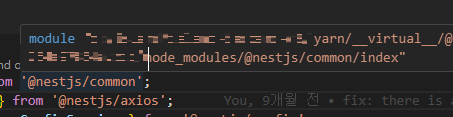
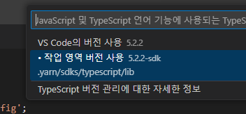
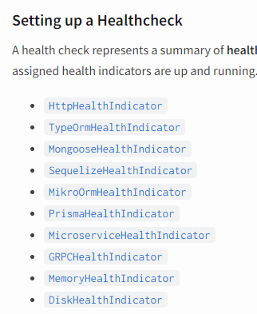
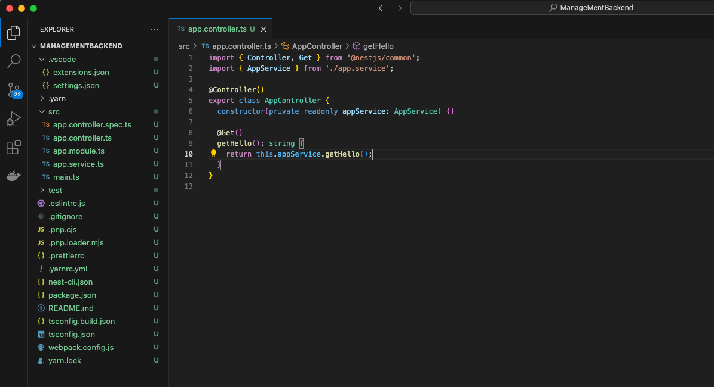
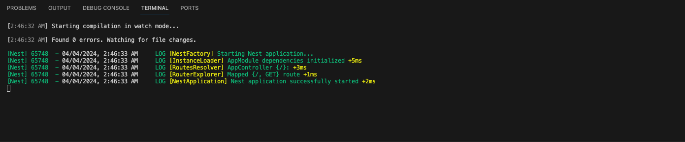

# yarn-berry로 NestJS 시작하기

> [node_modules로부터 우리를 구원해 줄 Yarn Berry](https://toss.tech/article/node-modules-and-yarn-berry)을 보고 정리한 내용입니다.
>
> [모노레포 적용부터 yarn berry까지](https://blog.hwahae.co.kr/all/tech/11962)을 보고 정리한 내용입니다.

완전히 빈 프로젝트 루트경로에서 nest new ./ 이렇게 프로젝트를 생성하고 package manager를 yarn으로 선택해서 프로젝트 생성

> yarn set version berry

> .gitignore에 추가

```
.yarn/*
!.yarn/cache
!.yarn/patches
!.yarn/plugins
!.yarn/releases
!.yarn/versions
```

만약 nodue_modules 폴더가 있다면 삭제

> yarn install

생성된 파일 중에 .yarnrc.yml 라는 파일이 존재한다. 해당 파일을 열고, nodeLinker 부분이 있는지 확인한다.

> nodeLinker: node-modules

nodeLinker가 node-modules면 nodeLinker 라인을 삭제하고, 남아있는 node_modules 폴더를 지워야 한다. Zero Install을 위해서 다시 yarn install을 실행하면 준비가 끝난다.

1. ZipFS 설치

> https://marketplace.visualstudio.com/items?itemName=arcanis.vscode-zipfs

vscode 익스텐션을 설치 한다.

2. VSCODE와 연동
   ZipFS와 연동하려면 다음 명령어를 실행해줘야 한다.

> yarn dlx @yarnpkg/sdks vscode
> yarn plugin import typescript

yarn dlx @yarnpkg/sdks vscode 를 하게 되면 자동으로
.vscode에 extensions.json과 settings.json이 생김

app.module.ts에 갔을때 아래와 같은 경로가 안나오면 vscode에서 무슨 메세지 뜨면서 allow 해주니까 제대로 경로 잡힘.

정상적으로 처리되었다면, 패키지에 마우스를 올렸을 때, 다음과 같이 `.yarn/__virtual*__/` 로 시작되는 경로로 패키지가 잡히게 된다


이 부분이 잘 되질 않는다면 타입스크립트 버전이 일치하지 않는 것이다. Ctrl + Shift + P를 누르고 Typescript 라고 입력하면 버전을 선택할 수 있는 항목이 보인다.

이때, 하단에 경로가 있는 .yarn/sdks/typescript/lib를 선택해줘야 한다.

- 활성화가 되어있지 않은 경우, .vscode 폴더의 settings.json의 경로를 확인하자

작업 영역의 루트에 있는 .vscode/settings.json에 다음과 같이 되어있어야 한다. 필자 같은 경우, backend 폴더의 경로에 .vscode가 생성돼 루트로 옮겨주었고 ./backend/를 따로 지정했다.

웹팩 설정
유령 의존성(Ghost dependencies) 문제로 실행 시, express나 webpack 등 몇몇 패키지에 대한 오류를 일으킬 수 있다. 실제로 이러런 유령 의존성 문제를 이야기 하는 패키지는 따로 설치해줘야 한다.

> yarn add express webpack ts-loader webpack-node-externals

또한 Yarn PnP을 사용할 경우, 웹팩 구성 파일도 변경해야 할 수 있다. 루트 디렉토리에 webpack.config.js를 생성하면 NestJS에서 이를 인식한다

```js
// webpack.config.js
import nodeExternals from 'webpack-node-externals';

const lazyImports = [
	'@nestjs/microservices/microservices-module',
	'@nestjs/websockets/socket-module',
	'@nestjs/platform-express',
	'swagger-ui-express',
	'class-transformer/storage',
	'@mapbox/node-pre-gyp',
];

export default (options, webpack) => ({
	...options,
	externals: [
		nodeExternals({
			modulesFromFile: true,
		}),
	],
	plugins: [
		...options.plugins,
		new webpack.IgnorePlugin({
			checkResource(resource) {
				if (lazyImports.includes(resource)) {
					try {
						require.resolve(resource);
					} catch (err) {
						return true;
					}
				}
				return false;
			},
		}),
	],
});
```

@nestjs/terminus 같은 경우에는 많은 유령 의존성 문제를 야기한다.

기본적으로 위 목록에 있는 것을 전부 설치해줘야 했다.
사용하지 않는다면 @nestjs/terminus를 yarn remove를 통해 삭제

여기까지 하고 나면 프로젝트 구조가 이렇게 되었다.


> yarn start:dev

yarn-berry를 이용하여 아주 빠르게 NestJS를 즐길 수 있게 되었다.

