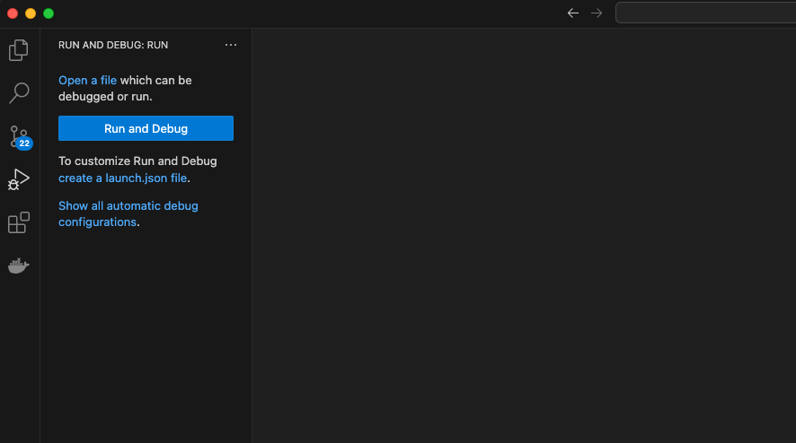
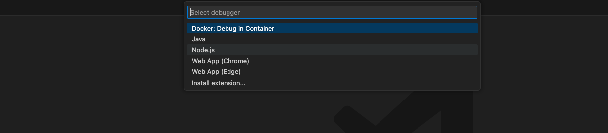
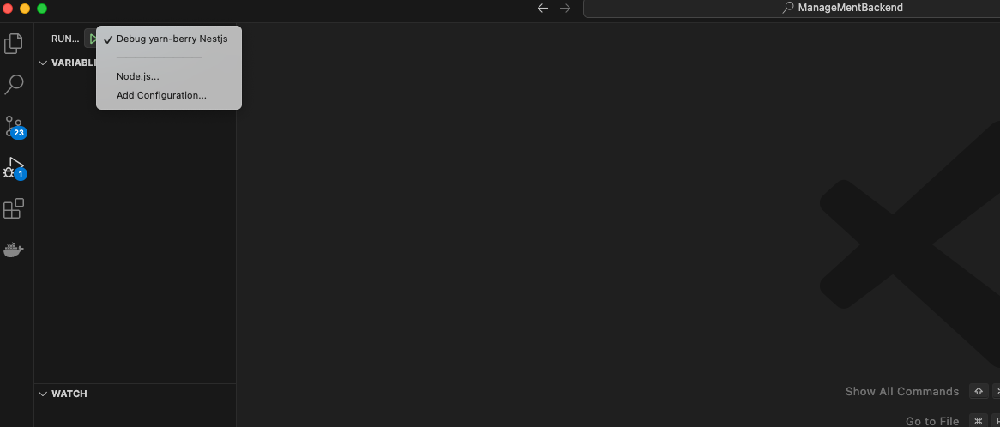
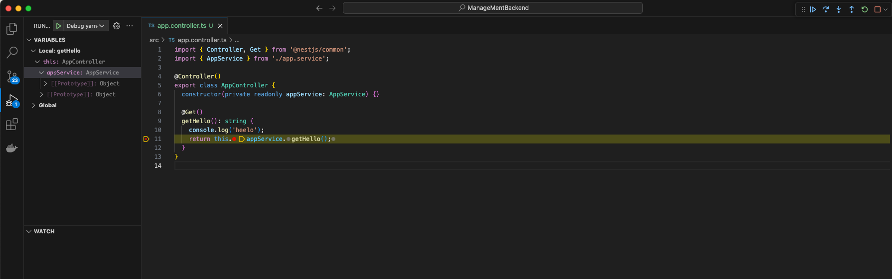

# console.log말고 Debugger 쓰자

## yarn으로 vscode debugger 사용하기

1. debug 탭으로 가서 `create a launch.json file` 을 생성한다.
   

2. Node.js를 선택한다.
   

3. .vscode/lauch.json 파일이 자동으로 생성 되었다.

- yarn

```json
{
	"version": "0.2.0",
	"configurations": [
		{
			"type": "node", // 세팅의 타입
			"request": "launch", // launch 실행하는거, attach 실행되있는거에 붙는거
			"name": "Debug yarn-berry Nestjs", // 어떤 이름으로 부를건지
			"runtimeExecutable": "yarn", // 어떤걸로 실행 할건지 node, yarn ...
			"runtimeArgs": ["start:debug"], // package.json의 script 부분 "start:debug"
			"console": "integratedTerminal", // intergratedTerminal은 vscode에서 실행하는 터미널임
			"restart": true, // 자동 연결 할건지
			"autoAttachChildProcesses": true // 디버거를 자동으로 process에 붙을지 말지 결정
		}
	]
}
```

- npm

```json
{
	// Use IntelliSense to learn about possible attributes.
	// Hover to view descriptions of existing attributes.
	// For more information, visit: https://go.microsoft.com/fwlink/?linkid=830387
	"version": "0.2.0",
	"configurations": [
		{
			"type": "node", // 세팅의 타입
			"request": "launch", // launch 실행하는거, attach 실행되있는거에 붙는거
			"name": "Debug NestJS", // 어떤 이름으로 부를건지
			"runtimeExecutable": "npm", // 어떤걸로 실행 할건지 node, yarn ...
			"runtimeArgs": ["run", "start:debug"], // npm run start:dev 에서 npm이 runtime이고 run start:dev가 Args임
			"console": "integratedTerminal", // intergratedTerminal은 vscode에서 실행하는 터미널임
			"restart": true, // 자동 연결 할건지
			"port": 9229,
			"autoAttachChildProcesses": true // 디버거를 자동으로 process에 붙을지 말지 결정
		}
	]
}
```

4. 다시 벌레모양 메뉴로 가게 되면 내가 만든 Debug yarn-berry Nestjs 디버거가 생긴걸 알 수 있다.
   

5. 사용할 브레이크 포인트(break point)를 찍어서 디버거가 잘 동작하는지 확인
   
